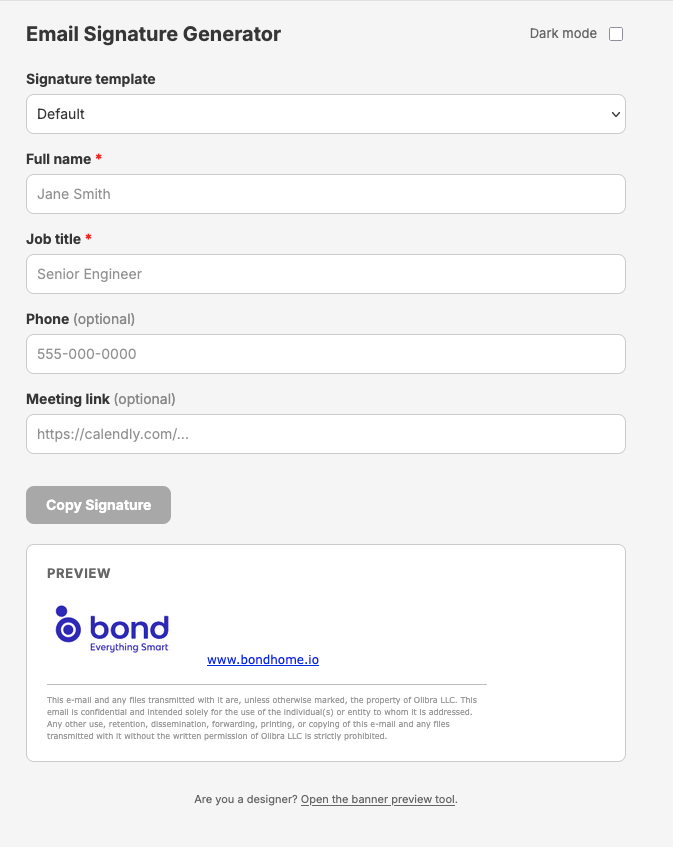

# Email Signature Generator

A web app for generating and copying customizable email signatures with event banner variants.

**Live site:** https://d1oxdoouo2fhid.cloudfront.net



---

## How it works

1. A user fills in their name, title, and phone number, then picks a banner variant.
2. The app renders a preview of the email signature and copies the HTML to the clipboard.
3. The signature can be pasted directly into an email client.

Banner images in `assets/` (named `banner-*.gif/png/jpg`) drive the available variants. Adding or removing a banner file automatically regenerates the templates via GitHub Actions.

---

## Adding a new banner

1. Add the image to `assets/` following the naming convention: `banner-<event-slug>.<ext>`
2. Push to `main` — the `generate-templates` workflow runs automatically, generates the new template, and commits it back.
3. Run `./deploy.sh` to publish the update.

---

## Local development

```bash
# Regenerate templates manually (runs automatically on push)
npm run generate

# Run tests
npm test
```

---

## Deployment

The site is hosted on S3 + CloudFront (`us-east-1`). Deployment is manual.

**Prerequisites:** AWS CLI configured with S3 write access and CloudFront invalidation permissions on the `bond-email-generator` bucket and distribution `E3VCUINQJZE3LA`.

```bash
./deploy.sh
```

Syncs `index.html`, `preview.html`, `assets/`, and `templates/` to S3, then invalidates the CloudFront cache. The live URL is printed at the end.
